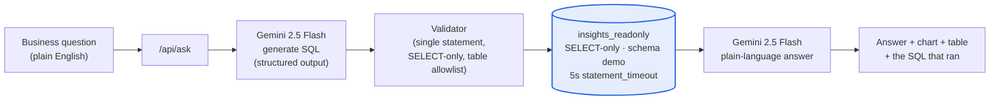

# Power Flow Insights

**A natural-language query layer over a real product's business data, with AI-generated SQL locked down by four independent security layers.**



*Blue node = the actual security boundary. Everything before it is a request; that's the point — see [Architecture](#architecture) below.*

## The business problem

A non-technical operator running a sales pipeline has simple, recurring questions — "which channel converts best," "where do leads drop off," "how many leads did we get last week." Answering any of them today means writing SQL or asking someone who can. That's a real bottleneck at small scale and a hard blocker once a team grows past the one person who knows the schema.

The obvious fix — let an LLM write the SQL — creates a worse problem if you stop there: an AI-generated query running against a real database with no guardrails is one bad generation away from a serious incident. This project is that fix, built with the guardrails treated as the actual deliverable, not an afterthought bolted on before shipping.

**The instrumented product is Power Flow OS**, the outreach CRM I built and run — not a toy schema. (Case study on that project separately, linked here once published.) **The queryable data is a synthetic dataset** that mirrors its schema (500 simulated leads, ~1,900 activity events), not real prospect data. Two separate decisions, two separate reasons: the CRM being real makes the security story concrete instead of hypothetical; the data being synthetic keeps real prospect information private in a repo that's public from commit one, and gives the funnel enough volume (500 leads) to be interesting to query — 15 real ones wouldn't be.

## Architecture

Three components, one request path: **the frontend** (React + Vite + TS) is a single page — a search bar, four suggested questions, and wherever the last answer landed. **`/api/ask`** (a Vercel serverless function, standard Fetch `Request`/`Response` — no framework SDK) is the whole pipeline: generate SQL, validate it, run it, summarize the result. **Postgres** (Supabase) holds two tables, `demo.leads` and `demo.activities`, in a schema isolated from Power Flow OS's real CRM data in `public`.

Two Gemini calls per question, not one: the first turns the question into SQL (structured output, so the shape is guaranteed); the second turns the query result back into a sentence a non-technical reader can use. Splitting them means each call has one job — the SQL-generation prompt never has to also worry about phrasing a sentence, and the answer-writing call sees real numbers instead of guessing.

## The security story

This is the actual subject of the project. Full writeup, including a real bug found during testing and empirical proof of what stopped it: **[docs/security.md](docs/security.md)**.

| Risk | Mitigation | Layer |
|---|---|---|
| Model generates destructive SQL (`DROP`, `DELETE`, …) | System prompt instructs SELECT/WITH only | 1 — prompt (weakest; a request, not a constraint) |
| Model ignores the prompt, or a keyword slips past a blocklist gap | Server-side validator: one statement, must start with SELECT/WITH, keyword blocklist, table allowlist, all checked against string-literal-blanked SQL so real data (like the status `'Call booked'`) can't cause false positives | 2 — validator (found and fixed two real bugs here during testing) |
| Layers 1 and 2 both fail | Connection runs as `insights_readonly`: SELECT-only, scoped to schema `demo`, zero grants anywhere else — including Power Flow OS's real CRM data in `public` | 3 — Postgres role (the layer that actually matters) |
| A query that's technically valid SELECT but expensive or slow (accidental cross join, `pg_sleep`, …) | `statement_timeout = 5s` set at the role level | 4 — timeout |
| A syntactically fine query that answers the wrong question | Second Gemini call answers only from the real returned rows; the SQL and explanation are always shown, never hidden | Trust, not security — see [Trade-offs](#trade-offs) |

The one-sentence version, tested against Google Cloud's own `pg_sleep`/`pg_read_file` functions: a real gap in layer 2 shipped, `pg_sleep(30)` sailed past the keyword blocklist because of a regex boundary bug, and layer 4 killed it at 5 seconds anyway. `pg_read_file` was rejected outright by layer 3's missing grants. Neither the prompt nor a clever validator is the story — the story is that no single layer had to be perfect.

## Results

*(Filled in once the 20-question evaluation set — Daniel's business questions, not self-graded — has run. See [Definition of done](#status) below for what that measures and how.)*

## Trade-offs

| Decision | Chosen | Why |
|---|---|---|
| PostHog vs. Mixpanel | **PostHog** | Free up to 1M events/month, self-hostable if that ever matters, native funnels. Mixpanel's free tier is more limited and closed-source. |
| Real vs. synthetic queryable data | **Synthetic** | Real prospect data has no business being in a public repo; 500 synthetic leads also just *look* like a funnel in a way that 15 real ones wouldn't. |
| Claude vs. Gemini for NL→SQL | **Gemini 2.5 Flash** | Same provider as Power Flow OS's own automations — one stack, not two. $0/month on the free tier. The security architecture (4 layers) is provider-agnostic by design; swapping models is a config change, not a rewrite. |
| One LLM call vs. two | **Two** (generate SQL, then summarize results) | Each call does one job. A single call trying to both write correct SQL *and* phrase a business-friendly sentence about data it hasn't seen yet either over-scopes the prompt or invites the model to guess at numbers instead of reading them. |
| A deterministic pipeline vs. an agent/LangChain | **Deterministic pipeline** | Two fixed calls with a validator between them is auditable, has predictable latency, and costs a known amount per question. An agent framework earns its complexity when a task needs multi-step exploration — this one doesn't; the schema is two tables. |

## Cost

$0/month. Gemini 2.5 Flash free tier, PostHog free tier, Supabase already running for Power Flow OS (this project adds one schema, not a new database), Vercel's free tier for a low-traffic serverless function.

## Local dev

```
npm install
cp .env.example .env   # fill in values, never commit this file
npm run dev
```

`GEMINI_API_KEY` and `DEMO_DB_URL` are required for `/api/ask` to do anything; `VITE_POSTHOG_KEY` is optional and the app is a complete no-op (zero requests) without it.

## Status

- [x] `demo` schema + `insights_readonly` role, permissions verified two ways (`SET ROLE` and a real pooler login) — [docs/security.md](docs/security.md)
- [x] ~500 synthetic leads, funnel differentiated by channel — [db/ground_truth.md](db/ground_truth.md)
- [x] Power Flow OS instrumented with PostHog + tracking plan — [docs/instrumentation.md](docs/instrumentation.md)
- [x] `/api/ask` with 4 security layers, structured output
- [x] Frontend built
- [ ] 20-question evaluation set run, % reported here honestly
- [ ] Deployed to Vercel
